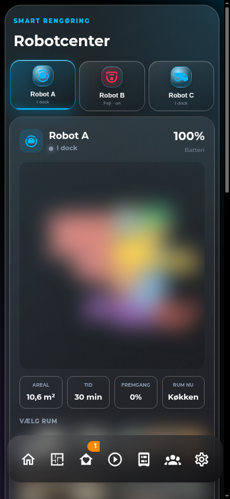

# HA Robot Fleet Card

Et samlet og responsivt robotcenter til Home Assistant. Kortet viser live status, fejl og batteri for et vilkårligt antal robotter og indlæser robotternes specialkort i én fælles visning.



## Funktioner

- Robotvælger med lagdelte gradienter, dybde og fysisk trykfeedback
- Automatisk skalerende robotvælger
- Live status, batteri og fejlmarkering
- Animation kun når robotten arbejder eller har fejl
- Understøtter forskellige specialkort til støvsugere og plæneklippere
- GUI-editor med titel og robotkonfiguration
- Tema-variabler med generiske fallbacks

## Installation

Tilføj filen som en module-resource:

```yaml
url: /local/ha-robot-fleet-card/ha-robot-fleet-card.js
type: module
```

## Eksempel

```yaml
type: custom:ha-robot-fleet-card
title: Robotcenter
robots:
  - name: Støvsuger
    icon: mdi:robot-vacuum
    entity: vacuum.robot
    battery: sensor.robot_battery
    error: sensor.robot_error
    card:
      type: custom:ha-roborock-vacuum-card
      title: Støvsuger
      vacuum: vacuum.robot
```

Listen skalerer automatisk fra én robot og op.

## Licens

MIT
